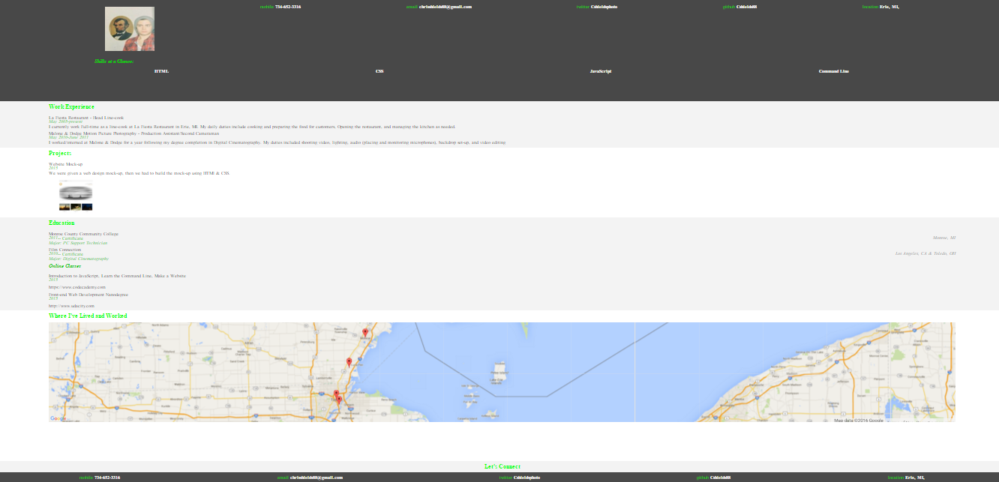

# Online Resume

###### Udacity Description
Once you've mastered the skills of a front end web developer you'll want to make a great first impression. You need a resume that stands out. The resume you build will not only help you build important skills, but will also make it easy to show employers why you’re perfect for the job. As you progress through this Nanodegree program you can update this resume with your new skills and projects.

Using jQuery, developed an interactive resume application that reads all data from a JSON file and then dynamically modifies the DOM to display the information. Further customized the project by personalizing the design using CSS.

[Live Site](http://cshields88.github.io/Udacity-FEND-Online-Resume)

